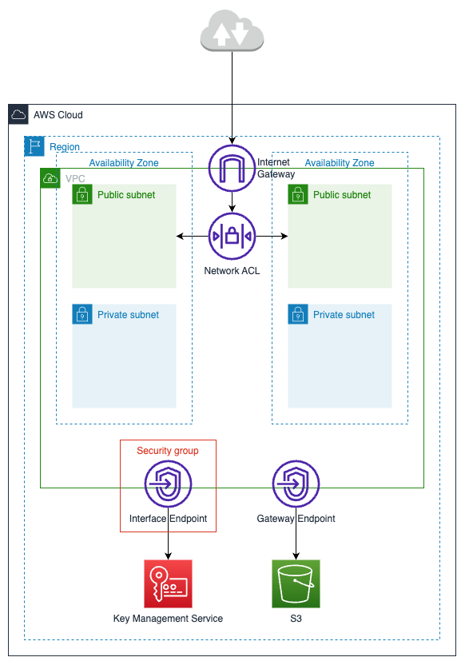
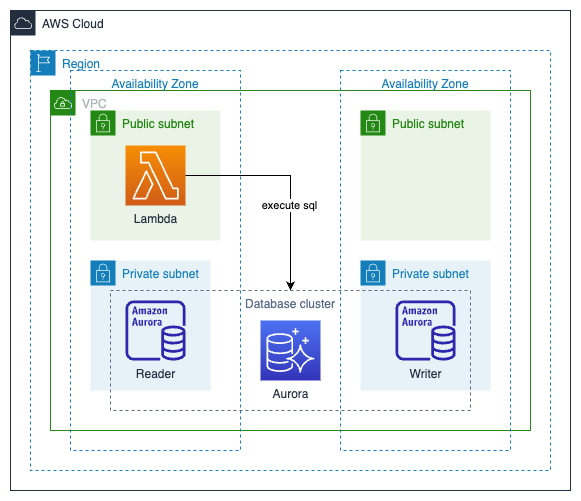

# aws-cdk-sandbox

> This project is part of my software architecture journey and more specifically the cloud platforms path. See my [software-architecture-journey](https://github.com/mykingdomforapawn/software-architecture-journey) repository for more details.

This collection of small projects is designed to explore and experiment with different concepts in the world of AWS Cloud Development Kit (CDK) using the Java programming language.

---

## Table of contents:

- [Bootstrapping](#bootstrapping)
- [Stack lifecycle](#stack-lifecycle)
- [Stack overview](#stack-overview)

---

## Bootstrapping

Have a look at the [official AWS documentation](https://docs.aws.amazon.com/cdk/v2/guide/bootstrapping.html) to get more details on the bootstrapping process in general. The following steps are some specifications to get this sandbox off the ground.

- Configure your CLI to interact with AWS: [official AWS documentation](https://docs.aws.amazon.com/cli/latest/userguide/cli-chap-configure.html)
- Create a policy that Cloudformation will use during deployments: `aws iam create-policy --policy-name CloudformationExecutionPolicy --policy-document file://policies/CloudformationExecutionPolicy.json`

- Get the policy arn from the generated output or the management console
- Get the user or role arn that you use to interact with AWS
- Run the bootstrapping command: `cdk bootstrap --cloudformation-execution-policies <policy arn> --trust <user or role arn>`

---

## Stack lifecycle
Have a look at the [official AWS documentation](https://docs.aws.amazon.com/cdk/v2/guide/work-with.html) to get more details on how to work with cdk in general. The following commands can be used to work with any stack in this repository.

- `cdk ls` list all stacks in the app
- `cdk synth <stack name>` emits the synthesized CloudFormation template
- `cdk diff <stack name>` compare deployed stack with current state`
- `cdk diff <stack name>` deploy this stack to your default AWS account/region
- `cdk destroy <stack name>` delete the current stack

## Stack overview
Each stack will be concisely outlined to provide a better understanding of its scope and purpose. Additionally, a visual representation to offer a clearer perspective on the created resources within the infrastructure is included.

### NetworkSandboxStack

### DatabaseSandboxStack

##database stack
mitpgadmin verbinden auf db und test queries ausführen

lambda erstellen mit https://www.youtube.com/watch?v=W-tzoGYMfTA
    im vpc 
rolle erstelen mit rds full access
richtige lanbda bauen 
    psycog2 einbinden (aus externem repo)
    kurze erklärung, warum
https://www.youtube.com/watch?v=NGteAkN2WYc 
https://github.com/jkehler/awslambda-psycopg2

!! hier weiter
    - künstlich erstellte iam policy für kms ins cdk einfügen
    - alte policy löschen
    - lambda so schreiben, dass der secret string ordentlich verwendet wird
    - db zugriff verünftig bauen
    - projekt abschließen

## iam auth in neuem projekt ausprobieren
https://www.youtube.com/watch?v=kGTAcj_zI3o